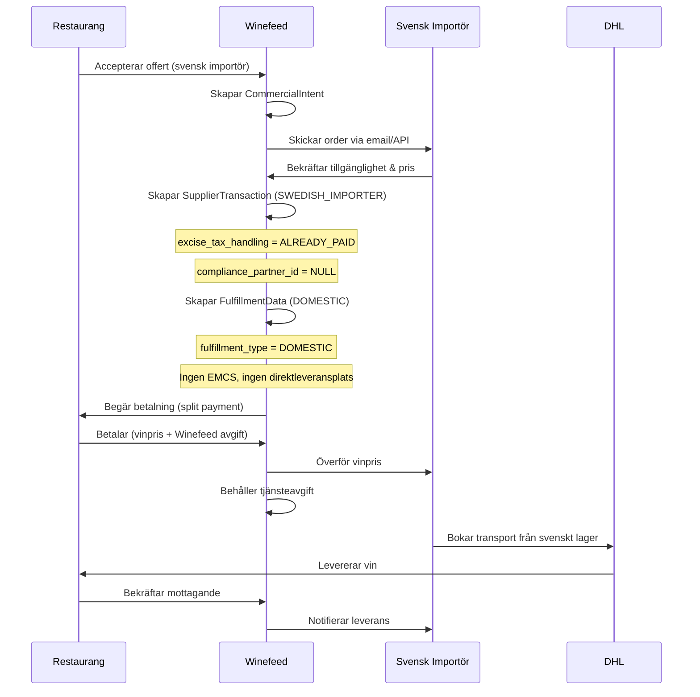
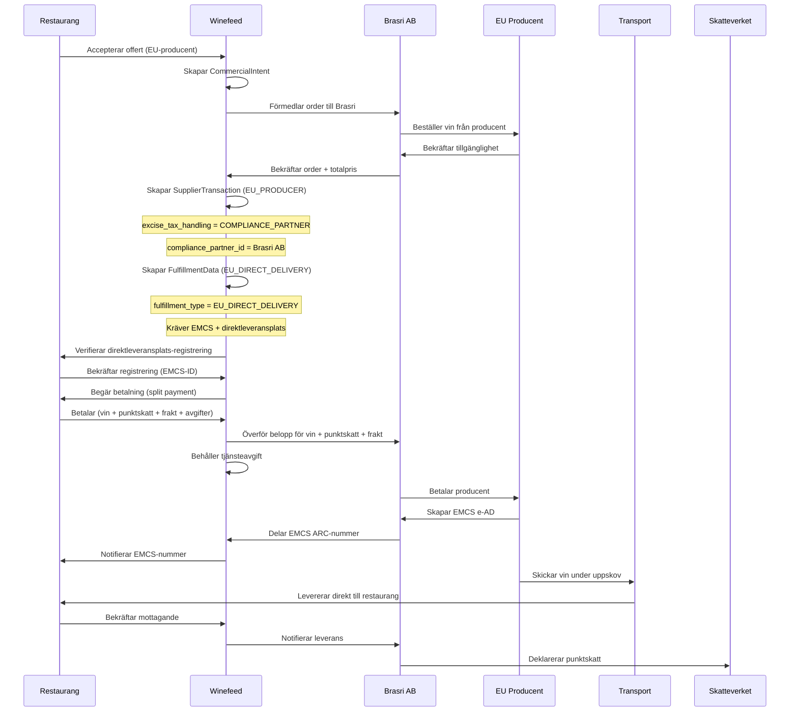

# Multi-Supplier Type Model: Svenska Importörer & EU-Leverantörer

**Syfte:** Utöka compliance-by-design-modellen för att stödja både svenska vinimportörer och EU-baserade leverantörer i samma system

**Status:** 🟢 Rekommenderad för implementering

**Baserat på:** compliance-by-design-datamodel.md

---

## Executive Summary

Winefeed ska kunna hantera **två olika juridiska flöden** samtidigt:

1. **Svenska vinimportörer** - Vin redan i Sverige, punktskatt betald, vanlig B2B-handel
2. **EU-baserade leverantörer** - Gränsöverskridande handel, uppskov, EMCS, Brasri hanterar compliance

**Nyckelprincip:** Leverantörstyp avgör vilket regelverk som tillämpas, inte restaurangens geografiska läge.

---

## Leverantörstyper

### Tabell: `suppliers` (utökad)

```sql
CREATE TABLE suppliers (
  -- Identitet
  supplier_id UUID PRIMARY KEY DEFAULT gen_random_uuid(),
  supplier_name VARCHAR(255) NOT NULL,
  org_number VARCHAR(20),

  -- NYTT: Leverantörstyp (avgör regelverk)
  supplier_type VARCHAR(20) NOT NULL,
    -- 'SWEDISH_IMPORTER': Licensierad svensk importör (vin redan i Sverige)
    -- 'EU_PRODUCER': EU-baserad producent (gränsöverskridande)
    -- 'EU_IMPORTER': EU-baserad importör (gränsöverskridande)

  -- Geografisk info
  country_code CHAR(2) NOT NULL,
  address_line1 VARCHAR(255),
  city VARCHAR(100),
  postal_code VARCHAR(20),

  -- Kontaktinfo
  contact_email VARCHAR(255),
  contact_phone VARCHAR(20),

  -- Licensiering (för SWEDISH_IMPORTER)
  alcohol_license_number VARCHAR(50),
  alcohol_license_verified BOOLEAN DEFAULT false,
  alcohol_license_expiry_date DATE,

  -- EMCS (för EU_PRODUCER/EU_IMPORTER)
  emcs_excise_id VARCHAR(50), -- Producentens EMCS-ID

  -- Logistik
  normal_delivery_time_days INT,
  minimum_order_value_sek DECIMAL(10,2),

  -- Status
  is_active BOOLEAN DEFAULT true,
  onboarded_at TIMESTAMPTZ,

  created_at TIMESTAMPTZ DEFAULT NOW(),
  updated_at TIMESTAMPTZ DEFAULT NOW(),

  CONSTRAINT valid_supplier_type CHECK (supplier_type IN (
    'SWEDISH_IMPORTER', 'EU_PRODUCER', 'EU_IMPORTER'
  )),

  -- Svenska importörer måste ha alkohollicens
  CONSTRAINT swedish_importer_requires_license CHECK (
    (supplier_type != 'SWEDISH_IMPORTER') OR
    (alcohol_license_number IS NOT NULL)
  ),

  -- EU-leverantörer måste ha EMCS-ID
  CONSTRAINT eu_supplier_requires_emcs CHECK (
    (supplier_type = 'SWEDISH_IMPORTER') OR
    (emcs_excise_id IS NOT NULL)
  )
);

CREATE INDEX idx_suppliers_type ON suppliers(supplier_type);
CREATE INDEX idx_suppliers_country ON suppliers(country_code);
CREATE INDEX idx_suppliers_active ON suppliers(is_active);
```

### TypeScript Interface

```typescript
export interface Supplier {
  supplier_id: string;
  supplier_name: string;
  org_number?: string;

  // Leverantörstyp (avgör regelverk)
  supplier_type: 'SWEDISH_IMPORTER' | 'EU_PRODUCER' | 'EU_IMPORTER';

  country_code: string;
  address_line1?: string;
  city?: string;
  postal_code?: string;

  contact_email?: string;
  contact_phone?: string;

  // Licensiering
  alcohol_license_number?: string;
  alcohol_license_verified: boolean;
  alcohol_license_expiry_date?: string;

  // EMCS
  emcs_excise_id?: string;

  // Logistik
  normal_delivery_time_days?: number;
  minimum_order_value_sek?: number;

  is_active: boolean;
  onboarded_at?: string;
  created_at: string;
  updated_at: string;
}
```

---

## Uppdaterad SupplierTransaction

### Tabell: `supplier_transactions` (utökad)

```sql
CREATE TABLE supplier_transactions (
  -- Identitet
  transaction_id UUID PRIMARY KEY DEFAULT gen_random_uuid(),
  transaction_reference VARCHAR(100) UNIQUE NOT NULL,

  -- Koppling
  intent_id UUID NOT NULL REFERENCES commercial_intents(intent_id) ON DELETE RESTRICT,

  -- Leverantör (med typ)
  supplier_id UUID NOT NULL REFERENCES suppliers(supplier_id),
  supplier_type VARCHAR(20) NOT NULL, -- Denormaliserat från suppliers för snabb access

  -- Köpare
  buyer_restaurant_id UUID NOT NULL REFERENCES restaurants(restaurant_id),
  buyer_restaurant_name VARCHAR(255) NOT NULL,
  buyer_org_number VARCHAR(20) NOT NULL,

  -- NYTT: Compliance Partner (endast för EU-leverantörer)
  -- För SWEDISH_IMPORTER: NULL (importören hanterar själv)
  -- För EU_PRODUCER/EU_IMPORTER: Brasri AB eller annan licensierad partner
  compliance_partner_id UUID REFERENCES importer_partners(partner_id),
  compliance_partner_name VARCHAR(255),

  -- Priser
  wine_subtotal_excl_vat_sek DECIMAL(10,2) NOT NULL,

  -- NYTT: Punktskattlogik (beror på leverantörstyp)
  excise_tax_handling VARCHAR(20) NOT NULL,
    -- 'ALREADY_PAID': För SWEDISH_IMPORTER (ingår i pris)
    -- 'COMPLIANCE_PARTNER': För EU_PRODUCER/EU_IMPORTER (Brasri betalar)
    -- 'BUYER_RESPONSIBLE': För edge case (ovanligt)

  excise_tax_liable_party VARCHAR(255), -- T.ex. "Brasri AB", "Arvid Nordquist AB"
  excise_tax_amount_sek DECIMAL(10,2) NOT NULL DEFAULT 0,

  -- Moms
  vat_rate DECIMAL(5,2) NOT NULL DEFAULT 25.00,
  vat_amount_sek DECIMAL(10,2) NOT NULL,

  -- Frakt
  shipping_cost_sek DECIMAL(10,2) DEFAULT 0,

  -- Total
  total_sek DECIMAL(10,2) NOT NULL,

  -- Status
  supplier_status VARCHAR(20) DEFAULT 'PENDING',
  payment_status VARCHAR(20) DEFAULT 'UNPAID',

  -- Juridiskt
  terms_accepted_at TIMESTAMPTZ,
  purchase_agreement_url VARCHAR(500),

  created_at TIMESTAMPTZ DEFAULT NOW(),
  updated_at TIMESTAMPTZ DEFAULT NOW(),
  confirmed_at TIMESTAMPTZ,
  paid_at TIMESTAMPTZ,

  CONSTRAINT valid_supplier_type CHECK (supplier_type IN (
    'SWEDISH_IMPORTER', 'EU_PRODUCER', 'EU_IMPORTER'
  )),

  CONSTRAINT valid_excise_tax_handling CHECK (excise_tax_handling IN (
    'ALREADY_PAID', 'COMPLIANCE_PARTNER', 'BUYER_RESPONSIBLE'
  )),

  -- EU-leverantörer måste ha compliance partner
  CONSTRAINT eu_requires_compliance_partner CHECK (
    (supplier_type = 'SWEDISH_IMPORTER') OR
    (compliance_partner_id IS NOT NULL)
  ),

  -- Svenska importörer ska ha ALREADY_PAID
  CONSTRAINT swedish_importer_excise_handling CHECK (
    (supplier_type != 'SWEDISH_IMPORTER') OR
    (excise_tax_handling = 'ALREADY_PAID')
  ),

  -- EU-leverantörer ska ha COMPLIANCE_PARTNER
  CONSTRAINT eu_supplier_excise_handling CHECK (
    (supplier_type = 'SWEDISH_IMPORTER') OR
    (excise_tax_handling = 'COMPLIANCE_PARTNER')
  )
);

CREATE INDEX idx_supplier_transactions_supplier ON supplier_transactions(supplier_id);
CREATE INDEX idx_supplier_transactions_type ON supplier_transactions(supplier_type);
CREATE INDEX idx_supplier_transactions_compliance ON supplier_transactions(compliance_partner_id);
```

### TypeScript Interface

```typescript
export interface SupplierTransaction {
  transaction_id: string;
  transaction_reference: string;
  intent_id: string;

  // Leverantör
  supplier_id: string;
  supplier_type: 'SWEDISH_IMPORTER' | 'EU_PRODUCER' | 'EU_IMPORTER';

  // Köpare
  buyer_restaurant_id: string;
  buyer_restaurant_name: string;
  buyer_org_number: string;

  // Compliance Partner (endast EU)
  compliance_partner_id?: string;
  compliance_partner_name?: string;

  // Priser
  wine_subtotal_excl_vat_sek: number;

  // Punktskatt
  excise_tax_handling: 'ALREADY_PAID' | 'COMPLIANCE_PARTNER' | 'BUYER_RESPONSIBLE';
  excise_tax_liable_party?: string;
  excise_tax_amount_sek: number;

  vat_rate: number;
  vat_amount_sek: number;
  shipping_cost_sek: number;
  total_sek: number;

  // Status
  supplier_status: SupplierStatus;
  payment_status: 'UNPAID' | 'PAID' | 'REFUNDED';

  terms_accepted_at?: string;
  purchase_agreement_url?: string;

  created_at: string;
  updated_at: string;
  confirmed_at?: string;
  paid_at?: string;
}
```

---

## Uppdaterad FulfillmentData

### Tabell: `fulfillment_data` (utökad)

```sql
CREATE TABLE fulfillment_data (
  fulfillment_id UUID PRIMARY KEY DEFAULT gen_random_uuid(),

  intent_id UUID NOT NULL REFERENCES commercial_intents(intent_id) ON DELETE RESTRICT,
  transaction_id UUID NOT NULL REFERENCES supplier_transactions(transaction_id) ON DELETE RESTRICT,

  -- NYTT: Fulfillment typ (beror på leverantörstyp)
  fulfillment_type VARCHAR(20) NOT NULL,
    -- 'DOMESTIC': För SWEDISH_IMPORTER (vanlig inrikes transport)
    -- 'EU_DIRECT_DELIVERY': För EU_PRODUCER/EU_IMPORTER (uppskov, EMCS)

  -- Direktleveransplats (ENDAST för EU_DIRECT_DELIVERY)
  direct_delivery_place_id VARCHAR(50),
  direct_delivery_place_registered BOOLEAN DEFAULT false,
  direct_delivery_place_registration_date DATE,

  -- Leveransadress
  delivery_address_line1 VARCHAR(255) NOT NULL,
  delivery_address_line2 VARCHAR(255),
  delivery_postal_code VARCHAR(10) NOT NULL,
  delivery_city VARCHAR(100) NOT NULL,
  delivery_country_code CHAR(2) DEFAULT 'SE',

  -- Serveringstillstånd (ALLTID obligatoriskt)
  serving_license_number VARCHAR(50) NOT NULL,
  serving_license_verified BOOLEAN DEFAULT false,
  serving_license_verified_at TIMESTAMPTZ,

  -- EMCS (ENDAST för EU_DIRECT_DELIVERY)
  emcs_arc_number VARCHAR(50) UNIQUE,
  emcs_ead_reference VARCHAR(100),
  emcs_dispatch_date TIMESTAMPTZ,
  emcs_expected_arrival_date DATE,
  emcs_actual_arrival_date TIMESTAMPTZ,
  emcs_reported_at TIMESTAMPTZ,

  -- Transport
  carrier VARCHAR(100),
  tracking_number VARCHAR(100),
  tracking_url VARCHAR(500),

  -- Status
  fulfillment_status VARCHAR(20) DEFAULT 'PENDING',

  -- Proof of Delivery
  pod_signature_url VARCHAR(500),
  pod_recipient_name VARCHAR(255),
  pod_timestamp TIMESTAMPTZ,

  -- Compliance (ENDAST för EU_DIRECT_DELIVERY)
  customs_declaration_number VARCHAR(100),
  customs_cleared_at TIMESTAMPTZ,
  excise_tax_declaration_reference VARCHAR(100),
  excise_tax_declared_by VARCHAR(255),
  excise_tax_declared_at TIMESTAMPTZ,
  excise_tax_paid_at TIMESTAMPTZ,

  created_at TIMESTAMPTZ DEFAULT NOW(),
  updated_at TIMESTAMPTZ DEFAULT NOW(),

  CONSTRAINT valid_fulfillment_type CHECK (fulfillment_type IN (
    'DOMESTIC', 'EU_DIRECT_DELIVERY'
  )),

  -- EU_DIRECT_DELIVERY måste ha EMCS och direktleveransplats
  CONSTRAINT eu_delivery_requires_emcs CHECK (
    (fulfillment_type = 'DOMESTIC') OR
    (emcs_arc_number IS NOT NULL AND direct_delivery_place_id IS NOT NULL)
  ),

  -- DOMESTIC ska INTE ha EMCS
  CONSTRAINT domestic_no_emcs CHECK (
    (fulfillment_type = 'EU_DIRECT_DELIVERY') OR
    (emcs_arc_number IS NULL AND direct_delivery_place_id IS NULL)
  )
);

CREATE INDEX idx_fulfillment_data_type ON fulfillment_data(fulfillment_type);
CREATE INDEX idx_fulfillment_data_transaction ON fulfillment_data(transaction_id);
```

---

## Beslutslogik: Regelverksval

### TypeScript Business Rules Engine

```typescript
export class SupplierTypeRulesEngine {
  /**
   * Avgör vilket regelverk som gäller baserat på leverantörstyp
   */
  static determineCompliance(
    supplier: Supplier
  ): {
    fulfillment_type: 'DOMESTIC' | 'EU_DIRECT_DELIVERY';
    excise_tax_handling: 'ALREADY_PAID' | 'COMPLIANCE_PARTNER';
    requires_emcs: boolean;
    requires_direct_delivery_place: boolean;
    requires_compliance_partner: boolean;
    requires_customs_clearance: boolean;
  } {
    switch (supplier.supplier_type) {
      case 'SWEDISH_IMPORTER':
        return {
          fulfillment_type: 'DOMESTIC',
          excise_tax_handling: 'ALREADY_PAID',
          requires_emcs: false,
          requires_direct_delivery_place: false,
          requires_compliance_partner: false,
          requires_customs_clearance: false,
        };

      case 'EU_PRODUCER':
      case 'EU_IMPORTER':
        return {
          fulfillment_type: 'EU_DIRECT_DELIVERY',
          excise_tax_handling: 'COMPLIANCE_PARTNER',
          requires_emcs: true,
          requires_direct_delivery_place: true,
          requires_compliance_partner: true,
          requires_customs_clearance: true,
        };

      default:
        throw new Error(`Unknown supplier type: ${supplier.supplier_type}`);
    }
  }

  /**
   * Validerar att transaktion följer korrekt regelverk
   */
  static validateTransaction(
    transaction: SupplierTransaction,
    supplier: Supplier
  ): { valid: boolean; errors: string[] } {
    const errors: string[] = [];
    const rules = this.determineCompliance(supplier);

    // Validera excise tax handling
    if (transaction.excise_tax_handling !== rules.excise_tax_handling) {
      errors.push(
        `Supplier type ${supplier.supplier_type} requires excise_tax_handling: ${rules.excise_tax_handling}, ` +
        `got: ${transaction.excise_tax_handling}`
      );
    }

    // Validera compliance partner
    if (rules.requires_compliance_partner && !transaction.compliance_partner_id) {
      errors.push(
        `Supplier type ${supplier.supplier_type} requires a compliance partner (e.g., Brasri AB)`
      );
    }

    if (!rules.requires_compliance_partner && transaction.compliance_partner_id) {
      errors.push(
        `Supplier type ${supplier.supplier_type} should NOT have a compliance partner`
      );
    }

    return {
      valid: errors.length === 0,
      errors,
    };
  }

  /**
   * Validerar att fulfillment följer korrekt regelverk
   */
  static validateFulfillment(
    fulfillment: FulfillmentData,
    supplier: Supplier
  ): { valid: boolean; errors: string[] } {
    const errors: string[] = [];
    const rules = this.determineCompliance(supplier);

    // Validera fulfillment type
    if (fulfillment.fulfillment_type !== rules.fulfillment_type) {
      errors.push(
        `Supplier type ${supplier.supplier_type} requires fulfillment_type: ${rules.fulfillment_type}, ` +
        `got: ${fulfillment.fulfillment_type}`
      );
    }

    // Validera EMCS
    if (rules.requires_emcs && !fulfillment.emcs_arc_number) {
      errors.push(
        `Supplier type ${supplier.supplier_type} requires EMCS (ARC number)`
      );
    }

    if (!rules.requires_emcs && fulfillment.emcs_arc_number) {
      errors.push(
        `Supplier type ${supplier.supplier_type} should NOT have EMCS`
      );
    }

    // Validera direktleveransplats
    if (rules.requires_direct_delivery_place && !fulfillment.direct_delivery_place_id) {
      errors.push(
        `Supplier type ${supplier.supplier_type} requires direct delivery place registration`
      );
    }

    if (!rules.requires_direct_delivery_place && fulfillment.direct_delivery_place_id) {
      errors.push(
        `Supplier type ${supplier.supplier_type} should NOT have direct delivery place`
      );
    }

    // Serveringstillstånd är ALLTID obligatoriskt
    if (!fulfillment.serving_license_verified) {
      errors.push('Serving license must be verified before delivery');
    }

    return {
      valid: errors.length === 0,
      errors,
    };
  }
}
```

---

## Flöde 1: Svenska Vinimportörer

### Scenario

- **Leverantör:** Arvid Nordquist (SWEDISH_IMPORTER)
- **Vin:** Redan i Sverige, punktskatt betald
- **Leverans:** Vanlig inrikes transport
- **Compliance:** Importören hanterar själv (har alkohollicens)

### Steg-för-steg



### Dataexempel

**Supplier:**
```json
{
  "supplier_id": "uuid",
  "supplier_name": "Arvid Nordquist Vin AB",
  "supplier_type": "SWEDISH_IMPORTER",
  "country_code": "SE",
  "alcohol_license_number": "SV-ALK-12345",
  "alcohol_license_verified": true,
  "emcs_excise_id": null
}
```

**SupplierTransaction:**
```json
{
  "transaction_id": "uuid",
  "supplier_id": "uuid",
  "supplier_type": "SWEDISH_IMPORTER",
  "compliance_partner_id": null,
  "wine_subtotal_excl_vat_sek": 8000,
  "excise_tax_handling": "ALREADY_PAID",
  "excise_tax_liable_party": "Arvid Nordquist Vin AB",
  "excise_tax_amount_sek": 0,
  "vat_amount_sek": 2000,
  "shipping_cost_sek": 300,
  "total_sek": 10300
}
```

**FulfillmentData:**
```json
{
  "fulfillment_id": "uuid",
  "fulfillment_type": "DOMESTIC",
  "direct_delivery_place_id": null,
  "emcs_arc_number": null,
  "serving_license_number": "ST-2024-12345",
  "serving_license_verified": true,
  "carrier": "DHL"
}
```

**Payment Split:**
```json
[
  {
    "recipient_type": "SUPPLIER",
    "recipient_name": "Arvid Nordquist Vin AB",
    "amount_sek": 10300,
    "description": "Wine purchase (excise tax already included)"
  },
  {
    "recipient_type": "WINEFEED_SERVICE",
    "recipient_name": "Winefeed AB",
    "amount_sek": 515,
    "description": "Platform service fee (5%)"
  }
]
```

**Total till restaurang:** 10,815 SEK (10,300 + 515)

---

## Flöde 2: EU-Baserade Leverantörer

### Scenario

- **Leverantör:** Château Margaux (EU_PRODUCER)
- **Compliance Partner:** Brasri AB
- **Vin:** Från Frankrike, gränsöverskridande
- **Leverans:** Direktleverans med uppskov
- **EMCS:** Obligatoriskt

### Steg-för-steg



### Dataexempel

**Supplier:**
```json
{
  "supplier_id": "uuid",
  "supplier_name": "Château Margaux",
  "supplier_type": "EU_PRODUCER",
  "country_code": "FR",
  "alcohol_license_number": null,
  "emcs_excise_id": "FR12AB3456789"
}
```

**SupplierTransaction:**
```json
{
  "transaction_id": "uuid",
  "supplier_id": "uuid",
  "supplier_type": "EU_PRODUCER",
  "compliance_partner_id": "brasri-uuid",
  "compliance_partner_name": "Brasri AB",
  "wine_subtotal_excl_vat_sek": 8000,
  "excise_tax_handling": "COMPLIANCE_PARTNER",
  "excise_tax_liable_party": "Brasri AB",
  "excise_tax_amount_sek": 2000,
  "vat_amount_sek": 2500,
  "shipping_cost_sek": 500,
  "total_sek": 13000
}
```

**FulfillmentData:**
```json
{
  "fulfillment_id": "uuid",
  "fulfillment_type": "EU_DIRECT_DELIVERY",
  "direct_delivery_place_id": "SE12345678",
  "direct_delivery_place_registered": true,
  "emcs_arc_number": "FR12AB34567890123456789",
  "emcs_ead_reference": "e-AD-FR-2026-00123",
  "serving_license_number": "ST-2024-12345",
  "serving_license_verified": true,
  "carrier": "Schenker",
  "excise_tax_declared_by": "Brasri AB"
}
```

**Payment Split:**
```json
[
  {
    "recipient_type": "IMPORTER",
    "recipient_name": "Brasri AB",
    "amount_sek": 12500,
    "description": "Wine + excise tax + shipping (via Brasri)"
  },
  {
    "recipient_type": "WINEFEED_SERVICE",
    "recipient_name": "Winefeed AB",
    "amount_sek": 625,
    "description": "Platform service fee (5%)"
  }
]
```

**Total till restaurang:** 13,125 SEK (12,500 + 625)

---

## Jämförelse: Svenska vs EU-Leverantörer

| Aspekt | Svenska Importörer | EU-Leverantörer |
|--------|-------------------|-----------------|
| **Leverantörstyp** | SWEDISH_IMPORTER | EU_PRODUCER / EU_IMPORTER |
| **Punktskatt** | Redan betald (ingår i pris) | Brasri betalar vid import |
| **Excise Tax Handling** | ALREADY_PAID | COMPLIANCE_PARTNER |
| **Compliance Partner** | ❌ Ingen (importören hanterar) | ✅ Brasri AB eller annan |
| **EMCS** | ❌ Inte relevant | ✅ Obligatoriskt (ARC-nummer) |
| **Direktleveransplats** | ❌ Inte relevant | ✅ Obligatoriskt (EMCS-ID) |
| **Fulfillment Type** | DOMESTIC | EU_DIRECT_DELIVERY |
| **Tullklarering** | ❌ Inte relevant | ✅ Brasri hanterar |
| **Transport** | Från svenskt lager | Direkt från EU-producent |
| **Winefeed's Roll** | Orkestrerar order + betalning | Orkestrerar order + betalning + compliance-partner |

---

## API Endpoints (uppdaterade)

### POST `/api/supplier-transactions` (med typ-baserad validering)

```typescript
const response = await fetch('/api/supplier-transactions', {
  method: 'POST',
  body: JSON.stringify({
    intent_id: 'uuid',
    supplier_id: 'arvid-nordquist-uuid',
    // Supplier type hämtas från suppliers-tabellen
    buyer_restaurant_id: 'uuid',
    wine_subtotal_excl_vat_sek: 8000,
    vat_rate: 25,
    vat_amount_sek: 2000,
    shipping_cost_sek: 300,
    total_sek: 10300,
  }),
});

// Backend avgör automatiskt:
// - supplier_type = 'SWEDISH_IMPORTER' (från supplier)
// - excise_tax_handling = 'ALREADY_PAID'
// - compliance_partner_id = null
// - excise_tax_amount_sek = 0

// Response
{
  transaction_id: 'uuid',
  supplier_type: 'SWEDISH_IMPORTER',
  excise_tax_handling: 'ALREADY_PAID',
  compliance_partner_id: null,
}
```

### POST `/api/fulfillment-data` (med typ-baserad validering)

```typescript
const response = await fetch('/api/fulfillment-data', {
  method: 'POST',
  body: JSON.stringify({
    transaction_id: 'uuid',
    delivery_address_line1: 'Kungsgatan 1',
    delivery_city: 'Stockholm',
    serving_license_number: 'ST-2024-12345',
  }),
});

// Backend avgör automatiskt:
// - fulfillment_type = 'DOMESTIC' (från supplier_type)
// - emcs_arc_number = null (inte relevant)
// - direct_delivery_place_id = null (inte relevant)

// Response
{
  fulfillment_id: 'uuid',
  fulfillment_type: 'DOMESTIC',
  emcs_arc_number: null,
}
```

---

## Validering: Multi-Supplier Type

### Fullständig Validator

```typescript
export class MultiSupplierValidator {
  /**
   * Validerar komplett order baserat på leverantörstyp
   */
  static async validateOrder(
    transaction: SupplierTransaction,
    fulfillment: FulfillmentData
  ): Promise<{ valid: boolean; errors: string[] }> {
    const errors: string[] = [];

    // Hämta leverantör
    const supplier = await getSupplier(transaction.supplier_id);

    // Validera att transaction följer regelverket
    const transactionValidation = SupplierTypeRulesEngine.validateTransaction(
      transaction,
      supplier
    );
    errors.push(...transactionValidation.errors);

    // Validera att fulfillment följer regelverket
    const fulfillmentValidation = SupplierTypeRulesEngine.validateFulfillment(
      fulfillment,
      supplier
    );
    errors.push(...fulfillmentValidation.errors);

    return {
      valid: errors.length === 0,
      errors,
    };
  }

  /**
   * Avgör om order kan skapas för given leverantör
   */
  static canCreateOrder(supplier: Supplier): { can: boolean; reason?: string } {
    if (!supplier.is_active) {
      return { can: false, reason: 'Supplier is not active' };
    }

    if (supplier.supplier_type === 'SWEDISH_IMPORTER') {
      if (!supplier.alcohol_license_verified) {
        return { can: false, reason: 'Alcohol license not verified' };
      }
      if (supplier.alcohol_license_expiry_date) {
        const expiry = new Date(supplier.alcohol_license_expiry_date);
        if (expiry < new Date()) {
          return { can: false, reason: 'Alcohol license has expired' };
        }
      }
    }

    if (supplier.supplier_type === 'EU_PRODUCER' || supplier.supplier_type === 'EU_IMPORTER') {
      if (!supplier.emcs_excise_id) {
        return { can: false, reason: 'EU supplier missing EMCS excise ID' };
      }
    }

    return { can: true };
  }
}
```

---

## Migration: Befintliga Leverantörer

### Steg 1: Klassificera befintliga leverantörer

```typescript
// För varje befintlig leverantör, avgör typ baserat på land
const suppliers = await getAllSuppliers();

for (const supplier of suppliers) {
  let supplier_type: string;

  if (supplier.country_code === 'SE') {
    // Svenska leverantörer → SWEDISH_IMPORTER
    supplier_type = 'SWEDISH_IMPORTER';

    // Verifiera att de har alkohollicens
    if (!supplier.alcohol_license_number) {
      console.warn(`Swedish supplier ${supplier.supplier_name} missing license`);
    }
  } else {
    // EU-leverantörer → EU_PRODUCER (default) eller EU_IMPORTER
    supplier_type = 'EU_PRODUCER';

    // Om leverantören är en importör snarare än producent, ändra till EU_IMPORTER
    if (supplier.is_importer) {
      supplier_type = 'EU_IMPORTER';
    }
  }

  await updateSupplier(supplier.supplier_id, { supplier_type });
}
```

### Steg 2: Uppdatera befintliga transaktioner

```typescript
// För varje befintlig transaktion, backfill supplier_type och excise_tax_handling
const transactions = await getAllTransactions();

for (const transaction of transactions) {
  const supplier = await getSupplier(transaction.supplier_id);

  let excise_tax_handling: string;

  if (supplier.supplier_type === 'SWEDISH_IMPORTER') {
    excise_tax_handling = 'ALREADY_PAID';
  } else {
    excise_tax_handling = 'COMPLIANCE_PARTNER';
  }

  await updateTransaction(transaction.transaction_id, {
    supplier_type: supplier.supplier_type,
    excise_tax_handling,
  });
}
```

---

## Sammanfattning

### Nyckelprinciper

1. **Leverantörstyp avgör regelverk** - Inte geografisk läge
2. **Svenska importörer** - Enklare flöde, punktskatt redan betald
3. **EU-leverantörer** - Komplexare, kräver compliance partner (Brasri)
4. **Båda kan samexistera** - Samma order kan ha båda typer
5. **Automatisk validering** - SQL constraints + TypeScript business rules
6. **Tydlig separation** - Winefeed äger aldrig vinkontraktet

### Verifieringskrav (uppfyllda)

- ✅ Vilken leverantörstyp gäller för denna offert?
  → `supplier.supplier_type` + `transaction.supplier_type`

- ✅ Vilket regelverk tillämpas?
  → `SupplierTypeRulesEngine.determineCompliance(supplier)`

- ✅ Är uppskov relevant eller inte?
  → `fulfillment.fulfillment_type === 'EU_DIRECT_DELIVERY'`

- ✅ Vem är skatte- och leveransansvarig aktör?
  → `transaction.excise_tax_liable_party` + `transaction.compliance_partner_name`

- ✅ Ingen logik antar att alla leverantörer följer samma flöde
  → SQL constraints + validation logic per typ

---

**Skapad:** 2026-01-14
**Granskad av:** [Jurist TBD]
**Nästa review:** Innan produktion
